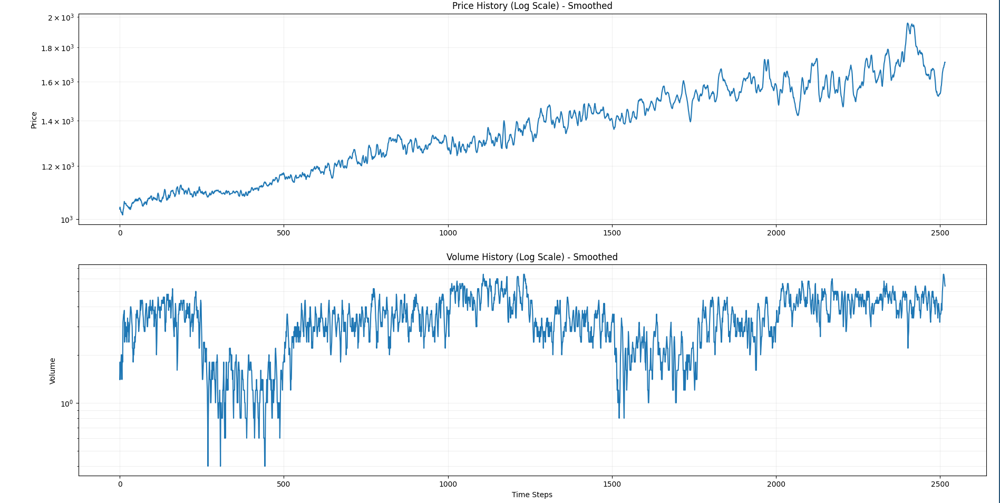

# Stock market simulation

Small naive agent-based stock market simulation. We create agents with different strategies, give them some initial money to trade, set up the inital price of one share and let them trade. Then, we can look what price and volume look like for different combinations of strategies, parameters, etc.

## Implemented strategies
- Random (randomly choose between buy, sell, hold)
- Trend following
- Mean reversion
- Genetic algorithm (each genetic agent can look at the specified number of prior dates to decide).

## Screenshots
